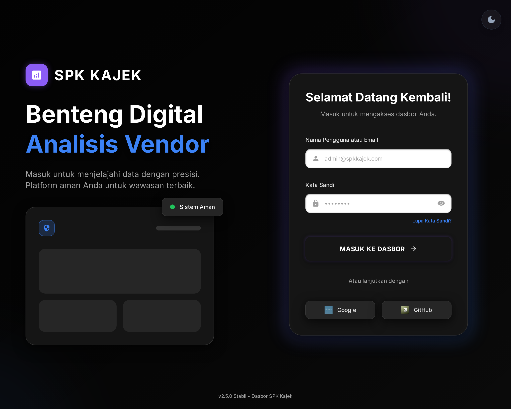

# 🚀 SPK Pemilihan Server Cloud Terbaik - PT Kajek Indonesia# 🚀 SPK Pemilihan Server Cloud Terbaik - PT Kajek Indonesia


[](https://react.dev/)[](https://www.python.org/)

[](https://www.typescriptlang.org/)[](https://streamlit.io/)

[](https://fastapi.tiangolo.com/)[](LICENSE)

[](https://tailwindcss.com/)

[](https://vitejs.dev/)Sistem Pendukung Keputusan (SPK) untuk memilih server cloud VPS terbaik menggunakan metode **TOPSIS** (Technique for Order Preference by Similarity to Ideal Solution) dengan dashboard interaktif modern.

[](LICENSE)


Sistem Pendukung Keputusan (SPK) untuk memilih server cloud VPS terbaik menggunakan metode **TOPSIS** (Technique for Order Preference by Similarity to Ideal Solution) dengan dashboard interaktif modern berbasis React.

## ✨ Fitur Utama



- 🎨 **Modern UI/UX** - Soft dark theme yang nyaman untuk mata

## ✨ Fitur Utama- 📊 **Interactive Charts** - Visualisasi dengan Plotly (bar, heatmap, radar)

- 🔄 **2-Way Integration** - Edit data di dashboard atau Excel

- 🎨 **Modern Dark UI/UX** - Soft dark theme dengan glassmorphism effects- ⚙️ **Dynamic Weights** - Adjust bobot kriteria real-time

- ⚡ **SPA (Single Page Application)** - Navigasi cepat tanpa reload- 📱 **Responsive** - Optimal di semua device

- 📊 **Interactive Charts** - Visualisasi dengan Recharts (bar, radar, trend)- 📥 **Export** - Download hasil ke CSV

- 🎭 **Framer Motion Animations** - Animasi halus dan interaktif- 💾 **Auto-Save** - Perubahan tersimpan otomatis ke Excel

- 🔐 **User Authentication** - Login system dengan JWT token

- ⚙️ **Dynamic Weights** - Adjust bobot kriteria real-time## 🚀 Quick Start

- 📱 **Responsive Design** - Optimal di semua device

- 📥 **Export PDF** - Download hasil analisa ke PDF### 1. Clone Repository

- 📜 **Calculation History** - Riwayat perhitungan tersimpan```bash

- 🎯 **TOPSIS Analysis** - Step-by-step calculation dengan visualisasigit clone https://github.com/Fahri-Hilm/SPK-Kajek.git

cd SPK-Kajek

## 🛠️ Tech Stack```


### Frontend### 2. Install Dependencies

| Technology | Purpose |```bash

|------------|---------|pip install -r requirements.txt

| React 18 | UI Framework |```

| TypeScript | Type Safety |

| Vite | Build Tool & Dev Server |### 3. Run Dashboard

| Tailwind CSS | Styling |```bash

| Framer Motion | Animations |./run_dashboard.sh

| Recharts | Data Visualization |```

| Lucide React | Icons |atau

| Axios | HTTP Client |```bash

| Three.js | 3D Visualizations |streamlit run dashboard.py

```

### Backend

| Technology | Purpose |### 4. Akses Dashboard

|------------|---------|Buka browser: **http://localhost:8501**

| FastAPI | REST API Framework |

| Python 3.8+ | Runtime |## 📊 Data Source

| Pandas | Data Processing |

| NumPy | Numerical Computation |Dashboard terintegrasi penuh dengan **TOPSIS_Input_Level.xlsx**:

| OpenPyXL | Excel File Handling |- Sheet: **1. Input Level**

| Jose (JWT) | Authentication |- Format: Level 1-5 untuk setiap kriteria

- Auto-convert ke nilai standar

## 📁 Project Structure

## 🎯 Kriteria & Level

```

SPK-Kajek/### 1. **CPU (BENEFIT)** - Bobot: 25%

├── frontend/                 # React Frontend| Level | Range | Nilai Standar |

│   ├── src/|-------|-------|---------------|

│   │   ├── components/       # React Components| ⭐ | 1-2 Core | 2 |

│   │   │   ├── DashboardView.tsx| ⭐⭐ | 3-4 Core | 4 |

│   │   │   ├── AnalysisView.tsx| ⭐⭐⭐ | 5-6 Core | 6 |

│   │   │   ├── CalculationView.tsx| ⭐⭐⭐⭐ | 7-8 Core | 8 |

│   │   │   ├── DataView.tsx| ⭐⭐⭐⭐⭐ | 9+ Core | 10 |

│   │   │   ├── HistoryView.tsx

│   │   │   ├── SettingsView.tsx### 2. **RAM (BENEFIT)** - Bobot: 25%

│   │   │   ├── LoginView.tsx| Level | Range | Nilai Standar |

│   │   │   └── ...|-------|-------|---------------|

│   │   ├── services/         # API Services| ⭐ | 1-2 GB | 2 |

│   │   │   └── api.ts| ⭐⭐ | 3-4 GB | 4 |

│   │   ├── context/          # React Context| ⭐⭐⭐ | 5-8 GB | 8 |

│   │   │   └── ThemeContext.tsx| ⭐⭐⭐⭐ | 9-16 GB | 16 |

│   │   ├── App.tsx| ⭐⭐⭐⭐⭐ | 17+ GB | 32 |

│   │   ├── main.tsx

│   │   └── index.css### 3. **Disk I/O (BENEFIT)** - Bobot: 25%

│   ├── package.json| Level | Range | Nilai Standar |

│   ├── tailwind.config.js|-------|-------|---------------|

│   ├── vite.config.ts| ⭐ | 100-200 MB/s | 150 |

│   └── tsconfig.json| ⭐⭐ | 201-400 MB/s | 300 |

├── backend/                  # FastAPI Backend| ⭐⭐⭐ | 401-600 MB/s | 500 |

│   ├── main.py               # API Endpoints| ⭐⭐⭐⭐ | 601-800 MB/s | 700 |

│   ├── topsis_service.py     # TOPSIS Algorithm| ⭐⭐⭐⭐⭐ | 801+ MB/s | 1000 |

│   ├── requirements.txt

│   ├── users.json### 4. **Harga (COST)** - Bobot: 25%

│   └── calculation_history.json| Level | Range | Nilai Standar |

├── start.sh                  # Startup Script|-------|-------|---------------|

├── TOPSIS_Input_Level.xlsx   # Data Source| 💰 | $5-$20 | 15 |

└── README.md| 💰💰 | $21-$50 | 35 |

```| 💰💰💰 | $51-$100 | 75 |

| 💰💰💰💰 | $101-$200 | 150 |

## 🚀 Quick Start| 💰💰💰💰💰 | $201+ | 250 |


### Prerequisites## 📊 Dashboard Tabs

- Node.js 18+ & npm

- Python 3.8+### 1. 📊 Ranking & Visualisasi

- pip- Top 10 bar chart dengan score

- Heatmap perbandingan kriteria

### 1. Clone Repository- Radar chart top 5 providers

```bash

git clone https://github.com/Fahri-Hilm/DSS-SPK_KAJEK.git### 2. 🧮 Perhitungan TOPSIS

cd DSS-SPK_KAJEK- Matriks keputusan

```- Normalisasi & pembobotan

- Solusi ideal (A+ & A-)

### 2. Setup Backend- Jarak Euclidean & score

```bash

cd backend### 3. 📋 Parameter Level

python -m venv venv- Panduan level 1-5 untuk setiap kriteria

source venv/bin/activate  # Linux/Mac- Tabel konversi level ke nilai

# atau: venv\Scripts\activate  # Windows

pip install -r requirements.txt### 4. ✏️ Edit Data (2-Way Integration)

```- Edit data langsung di dashboard

- Auto-save ke Excel

### 3. Setup Frontend- Reload data dari Excel

```bash- Preview perubahan real-time

cd frontend

npm install### 5. 📁 Data Lengkap

```- Tabel lengkap semua alternatif

- Export ke CSV

### 4. Run Application- Summary metrics


**Option A: Using start script**## 🔄 Integrasi 2-Way

```bash

./start.sh### Excel → Dashboard

``````bash

1. Edit TOPSIS_Input_Level.xlsx

**Option B: Manual start**2. Save (Ctrl+S)

3. Dashboard → Tab 4 → "🔄 Reload Data"

Terminal 1 - Backend:```

```bash

cd backend### Dashboard → Excel

source venv/bin/activate```bash

uvicorn main:app --reload --port 80001. Dashboard → Tab 4

```2. Pilih vendor

3. Edit level (1-5)

Terminal 2 - Frontend:4. Klik "💾 Simpan ke Excel"

```bash```

cd frontend

npm run dev## 🎓 Metode TOPSIS

```

TOPSIS memilih alternatif terbaik berdasarkan:

### 5. Access Application1. Jarak terdekat ke solusi ideal positif (A⁺)

- **Frontend**: http://localhost:51732. Jarak terjauh dari solusi ideal negatif (A⁻)

- **Backend API**: http://localhost:8000

- **API Docs**: http://localhost:8000/docs**Formula Score:**

```

## 🎯 Kriteria & LevelScore = D⁻ / (D⁺ + D⁻)

```

### 1. **CPU (BENEFIT)** - Default: 25%

| Level | Range | Nilai Standar |Dimana:

|-------|-------|---------------|- `D⁺` = Jarak ke solusi ideal positif

| ⭐ | 1-2 Core | 2 |- `D⁻` = Jarak ke solusi ideal negatif

| ⭐⭐ | 3-4 Core | 4 |

| ⭐⭐⭐ | 5-6 Core | 6 |## 📁 Struktur Project

| ⭐⭐⭐⭐ | 7-8 Core | 8 |

| ⭐⭐⭐⭐⭐ | 9+ Core | 10 |```

SPK-Kajek/

### 2. **RAM (BENEFIT)** - Default: 25%├── dashboard.py                    # Dashboard utama

| Level | Range | Nilai Standar |├── topsis_spk.py                   # Script Python TOPSIS

|-------|-------|---------------|├── TOPSIS_Input_Level.xlsx         # Data input (Level 1-5)

| ⭐ | 1-2 GB | 2 |├── requirements.txt                # Dependencies

| ⭐⭐ | 3-4 GB | 4 |├── run_dashboard.sh                # Script runner

| ⭐⭐⭐ | 5-8 GB | 8 |├── README.md                       # Dokumentasi utama

| ⭐⭐⭐⭐ | 9-16 GB | 16 |├── DASHBOARD_README.md             # Dokumentasi dashboard

| ⭐⭐⭐⭐⭐ | 17+ GB | 32 |├── QUICKSTART.md                   # Panduan cepat

├── FITUR_EDIT_2WAY.md             # Dokumentasi edit 2-way

### 3. **Disk I/O (BENEFIT)** - Default: 25%├── VERIFIKASI_INTEGRASI.md        # Verifikasi integrasi Excel

| Level | Range | Nilai Standar |└── COMPARISON.md                   # Perbandingan fitur

|-------|-------|---------------|```

| ⭐ | 100-200 MB/s | 150 |

| ⭐⭐ | 201-400 MB/s | 300 |## 🏆 Tech Stack

| ⭐⭐⭐ | 401-600 MB/s | 500 |

| ⭐⭐⭐⭐ | 601-800 MB/s | 700 |- **Frontend**: Streamlit + Custom CSS

| ⭐⭐⭐⭐⭐ | 801+ MB/s | 1000 |- **Charts**: Plotly (interactive)

- **Data**: Pandas + NumPy + openpyxl

### 4. **Harga (COST)** - Default: 25%- **Styling**: Soft Dark Theme

| Level | Range | Nilai Standar |- **Fonts**: Google Fonts (Inter)

|-------|-------|---------------|

| 💰 | $5-$20 | 15 |## 💡 Tips Penggunaan

| 💰💰 | $21-$50 | 35 |

| 💰💰💰 | $51-$100 | 75 |1. **Adjust Bobot** - Gunakan sidebar untuk mengubah prioritas kriteria

| 💰💰💰💰 | $101-$200 | 150 |2. **Explore Charts** - Hover pada chart untuk detail

| 💰💰💰💰💰 | $201+ | 250 |3. **Edit Data** - Ubah level di Tab 4 (dashboard atau Excel)

4. **Export** - Download hasil di Tab 5

## 📊 Application Views5. **Reload** - Refresh data kapan saja


### 1. 🏠 Dashboard## 📚 Dokumentasi Lengkap

- Overview statistics

- Top vendors preview- [Dashboard Detail](DASHBOARD_README.md)

- Interactive hero section- [Quick Start](QUICKSTART.md)

- Scrollytelling guide- [Fitur Edit 2-Way](FITUR_EDIT_2WAY.md)

- [Verifikasi Integrasi](VERIFIKASI_INTEGRASI.md)

### 2. 📈 Analysis- [Comparison](COMPARISON.md)

- Configure weights dengan sliders

- Run TOPSIS calculation## 🤝 Contributing

- Top 10 recommendations dengan ranking

- Interactive bar & radar chartsContributions are welcome! Please feel free to submit a Pull Request.


### 3. 🧮 Calculation## 📝 License

- Step-by-step TOPSIS process

- Decision matrixThis project is licensed under the MIT License.

- Normalized & weighted matrix

- Ideal solutions (A+ & A-)## 👨‍💻 Developer

- Distance calculations

- Final scores**PT Kajek Indonesia**  

Sistem Pendukung Keputusan - 2025

### 4. 📋 Data

- Full vendor data table## 📧 Contact

- Add/Edit/Delete vendors

- Export to CSV- GitHub: [@Fahri-Hilm](https://github.com/Fahri-Hilm)

- Repository: [SPK-Kajek](https://github.com/Fahri-Hilm/SPK-Kajek)

### 5. 📜 History

- Calculation history list---

- Trend charts over time

- Compare past analyses*Dibuat dengan ❤️ menggunakan Python, Streamlit, Plotly & Modern UI/UX Design*


### 6. ⚙️ Settings**Dashboard siap untuk presentasi dan production! 🚀✨**

- User profile management

- Theme preferences

- Change password

## 🔐 Authentication

Default credentials:
- **Username**: `admin`
- **Password**: `admin123`

## 📡 API Endpoints

| Method | Endpoint | Description |
|--------|----------|-------------|
| POST | `/api/login` | User authentication |
| GET | `/api/data` | Get all vendor data |
| POST | `/api/calculate` | Run TOPSIS calculation |
| GET | `/api/history` | Get calculation history |
| POST | `/api/vendor` | Add new vendor |
| PUT | `/api/vendor/{id}` | Update vendor |
| DELETE | `/api/vendor/{id}` | Delete vendor |

## 🎨 Design System

### Color Palette
```css
/* Dark Theme */
--dark-900: #0a0a0f
--dark-800: #12121a
--dark-700: #1a1a24
--dark-600: #22222e

/* Accent Colors */
--blue-500: #3b82f6
--green-500: #22c55e
--yellow-500: #eab308
--purple-500: #a855f7
```

### Typography
- **Font Family**: Inter, system-ui, sans-serif
- **Headings**: Bold, tracking-tight
- **Body**: Regular, text-slate-300/400

## 📄 License

MIT License - see [LICENSE](LICENSE) for details.

## 👥 Contributors

- **Fahri Hilmi** - Developer & Maintainer

## 🔗 Links

- **Repository**: [GitHub](https://github.com/Fahri-Hilm/DSS-SPK_KAJEK)
- **Issues**: [Report Bug](https://github.com/Fahri-Hilm/DSS-SPK_KAJEK/issues)

---

Made with ❤️ for PT Kajek Indonesia
